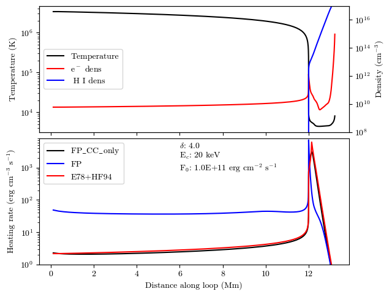

# Summary

During solar flares numerous particles (electrons, protons, and ions) are accelerated to high energies at the tops of magnetic flux loops in the solar corona. They travel down the loops interacting with and heating the ambient plasma over the course of their transport. This heating drives upflows of dense material into the magnetic loops, resulting in the intense bursts of radiation that characterize flares. The interaction of these high energy particles with the ambient solar atmosphere is well-represented by the Fokker-Planck kinetic theory [@Trubnikov:1965], which includes Coulomb force interactions coupled with magnetic and external electric field forces. Mathematically, the Fokker-Planck theory is represented by a nonlinear partial differential equation that must be solved numerically. The particular solution of the Fokker-Planck equation depends on the atmospheric conditions within the magnetic flux loop (e.g., temperature, density, ionization fractions, magnetic flux density) as well as the nonthermal distribution function of the flare-accelerated particles. Thus, particular solutions must be obtained for each flare that is to be analyzed. We have developed the FP package to efficiently perform this daunting computational task for arbitrary loop conditions and nonthermal particle distributions.

FP is a Fortran package developed with MPI for parallel processing and includes a Python and IDL wrapper to facilite ease of use. It is designed for use by solar and stellar physics researchers. It has been used as input to the radiation hydrodynamic model, RADYN [@Carlsson:1992; @Carlsson:1995; @Carlsson:1997; @Allred:2005; @Allred:2015], to model the solar atmosphere's response to the heating and nonthermal ionization produced by impacting flare-accelerated particles. It has also been used as a forward-modeling tool to invert X-rays observed during flares by NASA's Ramaty High Energy Solar Spectroscopic Imager (RHESSI; @Lin:2002) to determine the nonthermal particle distribution function leaving the acceleration site.  

# Examples

FP comes bundled with examples for the Python and IDL interfaces to demonstrate how FP can be used. In Figure \autoref{fig:example} we show the output plot produced from the Python example, compare\_fp\_e78.py. This example runs FP to simulate injecting electrons with a power-law distribution into a loop with half-length of 13 Mm and apex coronal temperature of 3.4 MK. First, FP is run in a mode including only Coulomb collisions to compare with the model from @Emslie:1978. Then FP is run including the return current to demonstrate its effect. This example produces a two-panel plot. The top panel shows the loop temperature (black line) and electron (red line) and hydrogen (blue line) density stratification. The bottom panel shows the heating rate predicted by FP for the Coulomb collisions only case (FP\_CC\_only; black line), the return current case (FP; blue line), and prediction using the model of @Emslie:1978 (E78+HF94; red line). 

# Acknowledgements
JCA acknowledges funding from the Heliophysics Innovation Fund and NASA's Heliophysics Supporting Research program. MA was supported by NASA's Heliophysics Supporting Research fund. AFK acknowledges funding from NSF AGS Solar-Terrestrial Award Number 1916511, and he thanks Prof. Lyndsay Fletcher for helpful discussions about velocity diffusion in solar flares. GSK was funded by an appointment to the NASA Postdoctoral Program at Goddard Space Flight Center, administered by USRA through a contract with NASA, and by the Heliophysics Innovation Fund. This code development benefited from discussions held at a meeting of Graham Kerr and Vanessa Polito’s International Space Science Institute team: `Interrogating Field-Aligned Solar Flare Models: Comparing, Contrasting and Improving.’

# References
